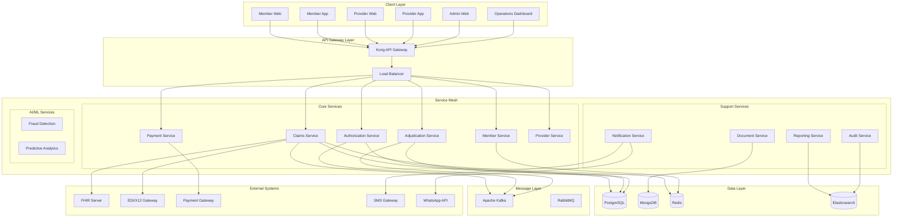

# Claims-Askes System Architecture

## Architecture Overview

The Claims-Askes platform follows a **microservices architecture** with **Domain-Driven Design (DDD)** principles, ensuring scalability, maintainability, and clear separation of concerns.



## Architectural Principles

### 1. Microservices Architecture
- **Single Responsibility**: Each service handles one business domain
- **Database per Service**: Each service owns its data
- **API First**: All communication through well-defined APIs
- **Event-Driven**: Asynchronous communication via events

### 2. Domain-Driven Design (DDD)
- **Bounded Contexts**: Clear boundaries between domains
- **Aggregate Roots**: Consistent domain models
- **Domain Events**: Business events drive workflows
- **Repository Pattern**: Data access abstraction

### 3. Cloud-Native Design
- **Containerized**: All services run in Docker containers
- **Kubernetes-Native**: Designed for Kubernetes deployment
- **12-Factor App**: Following cloud-native best practices
- **Stateless Services**: State managed in databases

### 4. Security by Design
- **Zero Trust**: Never trust, always verify
- **Defense in Depth**: Multiple security layers
- **Encryption Everywhere**: Data encrypted at rest and in transit
- **Audit Everything**: Comprehensive audit logging

## Service Architecture

### Core Services

#### Claims Engine Service
**Responsibility**: Core claims processing and workflow management
```yaml
Domain:
  - Claim submission
  - Claim validation
  - Workflow orchestration
  - Status management

Technology:
  - Language: Go
  - Framework: Gin
  - Database: PostgreSQL
  - Cache: Redis
  - Queue: Kafka

APIs:
  - REST: /api/v1/claims
  - gRPC: ClaimsService
  - GraphQL: claims queries/mutations

Events Published:
  - ClaimSubmitted
  - ClaimValidated
  - ClaimApproved
  - ClaimRejected
```

#### Authorization Service
**Responsibility**: Pre-authorization and medical necessity determination
```yaml
Domain:
  - Pre-authorization requests
  - Clinical guidelines
  - Medical necessity rules
  - Authorization tracking

Technology:
  - Language: Python
  - Framework: FastAPI
  - Database: PostgreSQL
  - ML Framework: TensorFlow

APIs:
  - REST: /api/v1/authorizations
  - gRPC: AuthorizationService

Events Published:
  - AuthorizationRequested
  - AuthorizationApproved
  - AuthorizationDenied
```

#### Adjudication Service
**Responsibility**: Claims adjudication and benefit determination
```yaml
Domain:
  - Benefit calculation
  - Rule engine
  - Accumulator management
  - COB/TPL processing

Technology:
  - Language: Go
  - Framework: Echo
  - Database: PostgreSQL
  - Rules Engine: Drools

APIs:
  - REST: /api/v1/adjudication
  - gRPC: AdjudicationService

Events Published:
  - AdjudicationCompleted
  - BenefitCalculated
  - AccumulatorUpdated
```

### Frontend Architecture

#### Web Applications
**Technology Stack**:
```yaml
Framework: React 18
Language: TypeScript
State Management: Redux Toolkit + RTK Query
UI Library: Ant Design Pro
Build Tool: Vite
Testing: Jest + React Testing Library + Cypress
Styling: CSS Modules + Tailwind CSS
```

**Application Structure**:
```typescript
// Feature-based structure
src/
  features/
    claims/
      components/    // UI components
      hooks/        // Custom hooks
      services/     // API calls
      store/        // Redux slices
      types/        // TypeScript types
      utils/        // Utilities
```

#### Mobile Applications
**Technology Stack**:
```yaml
Framework: React Native 0.72+
Language: TypeScript
State Management: Redux Toolkit + Redux Persist
UI Library: React Native Elements
Navigation: React Navigation 6
Testing: Jest + React Native Testing Library
Platform: iOS 13+ / Android 6+
```

## Data Architecture

### Primary Database (PostgreSQL)
```sql
-- Domain-driven schema design
schemas:
  - claims       # Claims domain
  - member       # Member domain
  - provider     # Provider domain
  - benefit      # Benefit configuration
  - policy       # Policy management
  - payment      # Payment processing
```

### Document Store (MongoDB)
```javascript
// Collections
{
  documents: {},      // Uploaded documents
  templates: {},      // Document templates
  audit_logs: {},     // Audit trail
  notifications: {}   // Notification history
}
```

### Cache Layer (Redis)
```yaml
Use Cases:
  - Session management
  - API rate limiting
  - Temporary data storage
  - Real-time data
  - Distributed locks
```

### Search Engine (Elasticsearch)
```yaml
Indices:
  - claims_index
  - providers_index
  - members_index
  - audit_index
```

## Integration Architecture

### API Gateway (Kong)
```yaml
Features:
  - Authentication/Authorization
  - Rate Limiting
  - Request/Response Transformation
  - Load Balancing
  - Circuit Breaking
  - API Analytics

Plugins:
  - JWT Authentication
  - OAuth 2.0
  - Rate Limiting
  - CORS
  - Request Transformer
  - Response Transformer
```

### Message Queue Architecture
```yaml
Kafka Topics:
  - claims.events
  - payment.events
  - member.events
  - provider.events
  - notification.events

RabbitMQ Queues:
  - email.queue
  - sms.queue
  - document.processing.queue
```

### External Integrations
```yaml
FHIR R4:
  - Claim Resource
  - ClaimResponse Resource
  - Coverage Resource
  - Patient Resource

EDI X12:
  - 837 Healthcare Claim
  - 835 Healthcare Claim Payment
  - 270/271 Eligibility
  - 276/277 Claim Status

Payment Gateways:
  - Stripe
  - Xendit (Indonesia)
  - Midtrans (Indonesia)
```

## Deployment Architecture

### Kubernetes Deployment
```yaml
Namespaces:
  - claims-production
  - claims-staging
  - claims-dev

Resources:
  - Deployments: Stateless services
  - StatefulSets: Databases
  - Services: Internal communication
  - Ingress: External access
  - ConfigMaps: Configuration
  - Secrets: Sensitive data
  - HPA: Auto-scaling
  - PDB: Pod Disruption Budget
```

### Multi-Region Deployment
```yaml
Regions:
  Primary: ap-southeast-1 (Singapore)
  Secondary: ap-southeast-2 (Jakarta)

Strategy:
  - Active-Active for API services
  - Active-Passive for databases
  - Cross-region replication
  - Global load balancing
```

## Security Architecture

### Authentication & Authorization
```yaml
Authentication:
  - OAuth 2.0 / OIDC
  - JWT tokens
  - MFA support
  - Biometric (mobile)

Authorization:
  - RBAC (Role-Based Access Control)
  - ABAC (Attribute-Based Access Control)
  - Policy-based authorization
  - Fine-grained permissions
```

### Data Security
```yaml
Encryption:
  - At Rest: AES-256
  - In Transit: TLS 1.3
  - Key Management: AWS KMS / HashiCorp Vault

Data Protection:
  - PII masking
  - Data tokenization
  - Field-level encryption
  - Audit logging
```

## Monitoring & Observability

### Metrics (Prometheus + Grafana)
```yaml
Metrics:
  - System: CPU, Memory, Disk, Network
  - Application: Request rate, Error rate, Duration
  - Business: Claims processed, Authorization rate
  - Custom: Domain-specific metrics
```

### Logging (ELK Stack)
```yaml
Log Levels:
  - ERROR: System errors
  - WARN: Warnings
  - INFO: Information
  - DEBUG: Debugging
  
Structured Logging:
  - JSON format
  - Correlation IDs
  - Context propagation
```

### Tracing (Jaeger)
```yaml
Distributed Tracing:
  - Request flow visualization
  - Performance bottleneck identification
  - Error tracking
  - Service dependency mapping
```

## Performance Requirements

### SLA Targets
```yaml
Availability: 99.99% (52 minutes downtime/year)
Response Time:
  - API Gateway: < 50ms
  - Claims Submission: < 500ms
  - Authorization: < 100ms
  - Search: < 200ms

Throughput:
  - Claims: 1000 TPS
  - Authorizations: 500 TPS
  - API Gateway: 10000 TPS

Scalability:
  - Horizontal scaling
  - Auto-scaling based on metrics
  - Zero-downtime deployments
```

## Disaster Recovery

### Backup Strategy
```yaml
Databases:
  - Full backup: Daily
  - Incremental: Hourly
  - Transaction logs: Continuous
  - Retention: 30 days

Documents:
  - Object storage backup
  - Cross-region replication
  - Versioning enabled

Recovery Targets:
  - RTO: 1 hour
  - RPO: 15 minutes
```

### Failover Strategy
```yaml
Database Failover:
  - Automatic failover
  - Read replicas promotion
  - Connection pooling redirect

Service Failover:
  - Circuit breaker pattern
  - Retry with exponential backoff
  - Fallback responses

Region Failover:
  - DNS-based routing
  - Health check monitoring
  - Automatic traffic shifting
```

## Development Best Practices

### Code Organization
- Clean Architecture
- SOLID Principles
- DRY (Don't Repeat Yourself)
- KISS (Keep It Simple, Stupid)

### Testing Strategy
```yaml
Unit Tests: 80% coverage minimum
Integration Tests: Critical paths
E2E Tests: User journeys
Performance Tests: Load testing
Security Tests: OWASP compliance
```

### CI/CD Pipeline
```yaml
Stages:
  1. Code Commit
  2. Build
  3. Unit Tests
  4. Integration Tests
  5. Security Scan
  6. Docker Build
  7. Push to Registry
  8. Deploy to Dev
  9. E2E Tests
  10. Deploy to Staging
  11. Performance Tests
  12. Deploy to Production
```

## Technology Decision Records

### ADR-001: Microservices over Monolith
**Status**: Accepted
**Context**: Need for scalability and team autonomy
**Decision**: Adopt microservices architecture
**Consequences**: Increased complexity, better scalability

### ADR-002: Go for Core Services
**Status**: Accepted
**Context**: Need for high performance and concurrency
**Decision**: Use Go for core backend services
**Consequences**: Better performance, smaller learning curve

### ADR-003: React for Web Applications
**Status**: Accepted
**Context**: Need for rich, interactive UIs
**Decision**: Use React with TypeScript
**Consequences**: Large ecosystem, good developer experience

### ADR-004: PostgreSQL as Primary Database
**Status**: Accepted
**Context**: Need for ACID compliance and complex queries
**Decision**: Use PostgreSQL for transactional data
**Consequences**: Proven reliability, good performance

---

*This architecture ensures a scalable, maintainable, and secure health insurance platform that can handle millions of claims while maintaining high availability and performance.*