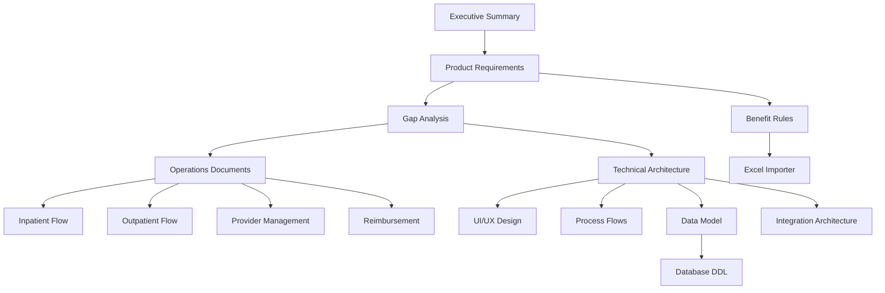

# 📚 Documentation Navigation Guide

## Quick Navigation

### 🎯 Start Here
- [Executive Summary](../init_desg/claims_executive_summary_v_0.md) - High-level overview
- [CLAUDE.md](../CLAUDE.md) - Quick reference for development
- [Document Index](../init_desg/claims_index_ownership_map_v_0.md) - Complete document map

## Documentation by Category

### 📋 Business Requirements
Essential business documentation for understanding system requirements.

| Document | Purpose | Audience |
|----------|---------|----------|
| [Product Requirements & Journey](../init_desg/claims_prd_core_journey_v_0.md) | Core product features and user journeys | Product, Business |
| [Group Policy & Benefit Rules](../init_desg/claims_group_policy_benefit_rules_v_0.md) | Benefit calculation and policy rules | Product, Operations |
| [Gap Analysis & Recommendations](../init_desg/claims_gap_analysis_recommendations_v_0.md) | System gaps and improvement roadmap | Leadership, Product |

### 🏥 Healthcare Operations
Detailed operational workflows for healthcare services.

#### Inpatient Services
| Document | Focus Area |
|----------|------------|
| [Inpatient UM & e-GL](../init_desg/claims_servicing_um_inpatient_e_gl_v_0.md) | Admission, guarantee letters, utilization management |
| [Discharge & Billing](../init_desg/claims_inpatient_discharge_billing_v_0.md) | Discharge planning, billing reconciliation, payment |

#### Outpatient Services
| Document | Focus Area |
|----------|------------|
| [Outpatient Servicing Flow](../init_desg/claims_outpatient_servicing_flow_v_0.md) | Consultation, diagnostics, pharmacy, payment |
| [Reimbursement Operations](../init_desg/claims_reimbursement_operations_v_0.md) | Out-of-network claims, receipt validation, fraud prevention |

### 🏢 Provider Management
Complete provider lifecycle management documentation.

| Document | Coverage |
|----------|----------|
| [Provider Network Management](../init_desg/claims_provider_network_management_v_0.md) | Credentialing, contracting, performance, quality metrics |

### 💰 Financial Controls
Cost management and authorization systems.

| Document | Focus |
|----------|-------|
| [Real-Time Cost Control & Auth](../init_desg/claims_realtime_cost_control_auth_v_0.md) | ML-powered authorization, cost prediction, fraud detection |

### 🖥️ Technical Architecture
Complete technical design documentation.

#### User Interface
| Document | Scope |
|----------|-------|
| [UI/UX Design Specifications](../init_desg/ui_ux_design_specifications_v_0.md) | All portals, mobile apps, dashboards |

#### System Design
| Document | Coverage |
|----------|----------|
| [Process Flow Diagrams](../init_desg/process_flow_diagrams_v_0.md) | Business processes, state machines, decision trees |
| [Data Model Design](../init_desg/data_model_design_v_0.md) | Database schemas, relationships, optimization |
| [System Integration Architecture](../init_desg/system_integration_architecture_v_0.md) | APIs, microservices, external integrations |

### 🔧 Implementation
Technical implementation files and specifications.

| File | Purpose |
|------|---------|
| [Database DDL](../init_desg/claims_sql_ddl_postgre_sql_v_0.sql) | PostgreSQL schema definitions |
| [Excel Importer](../init_desg/claims_excel_importer_python_v_0.py) | Python script for data import |
| [Sample Payloads](../init_desg/claims_sample_payloads_fhir_x_12_v_0.md) | FHIR and X12 examples |

### 📊 Reference Data
Excel files with configuration data.

| File | Content |
|------|---------|
| [Benefit_Premi.xlsx](../refs/Benefit_Premi.xlsx) | Benefit and premium configurations |
| [T_C.xlsx](../refs/T_C.xlsx) | Terms and conditions |

## Reading Order Recommendations

### For Product Managers
1. Executive Summary
2. Product Requirements & Journey
3. Gap Analysis
4. UI/UX Design Specifications

### For Developers
1. CLAUDE.md (Quick Reference)
2. Data Model Design
3. System Integration Architecture
4. Process Flow Diagrams
5. Database DDL

### For Business Analysts
1. Product Requirements
2. Process Flow Diagrams
3. Benefit Rules
4. All Operations documents

### For Healthcare Operations
1. Inpatient UM & e-GL
2. Outpatient Servicing Flow
3. Provider Network Management
4. Reimbursement Operations

### For System Architects
1. System Integration Architecture
2. Data Model Design
3. Real-Time Cost Control
4. Process Flow Diagrams

## Document Relationships

## Key Concepts Index

### A-C
- **Accumulators**: Data Model, Benefit Rules
- **Authorization**: Real-Time Cost Control, Process Flows
- **Benefits**: Benefit Rules, Data Model

### D-F
- **Discharge**: Inpatient Discharge & Billing
- **e-GL (Guarantee Letter)**: Inpatient UM & e-GL
- **Fraud Detection**: Reimbursement Operations, Cost Control

### G-M
- **Integration**: System Integration Architecture
- **Member Portal**: UI/UX Design
- **Microservices**: Integration Architecture

### N-P
- **OCR**: Reimbursement Operations
- **Outpatient**: Outpatient Servicing Flow
- **Provider Network**: Provider Management

### Q-Z
- **Reimbursement**: Reimbursement Operations
- **State Machines**: Process Flow Diagrams
- **Utilization Management**: Inpatient UM

## Search Tips

- Use document titles for broad topics
- Check the Data Model for database structures
- Review Process Flows for business logic
- Consult UI/UX Design for interface details
- Reference Integration Architecture for APIs

---

*Last Updated: August 14, 2025*