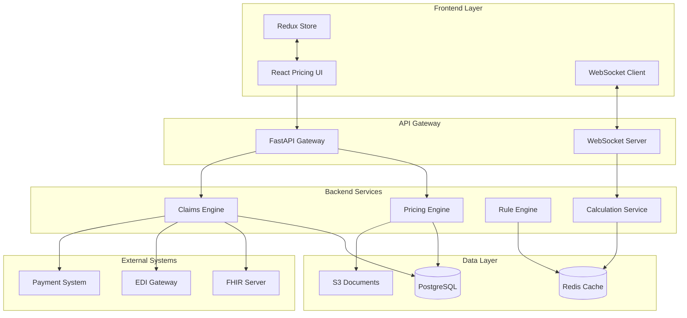

# Pricing Configuration & Claims Integration Architecture

## Executive Summary

This document describes the integration of the Excel-based group health insurance pricing tool into the modern claims processing system. The solution transforms a manual Excel-based workflow into a scalable, real-time web application while maintaining familiar UI patterns for business users.

## System Architecture Overview



## Key Integration Points

### 1. Database Schema Integration

The pricing schema (`pricing.*`) integrates with the existing claims schema (`claims.*`) through:

```sql
-- Key integration tables
pricing.policy_pricing_link -- Links pricing config to claims.policy
pricing.policy_config       -- References claims.plan_benefit
pricing.policy_member       -- Maps to claims.member
pricing.rate_table          -- Feeds claims.scheduled_benefit
```

### 2. Data Flow Architecture

#### Configuration to Policy Flow
```
1. Pricing Configuration Created (Draft)
   └─> Benefits Selected & TC Factors Applied
       └─> Members Enrolled
           └─> Premium Calculated
               └─> Configuration Approved
                   └─> Policy Created in Claims System
                       └─> Benefits Mapped to plan_benefit
                           └─> Members Synced to claims.member
                               └─> Ready for Claims Processing
```

#### Real-time Premium Calculation
```
User Input Change
    ├─> WebSocket Event
    ├─> Pricing Engine Calculation
    ├─> Factor Application
    ├─> Member Premium Aggregation
    ├─> Cache Update (Redis)
    └─> UI Update via WebSocket
```

### 3. Service Integration

#### Pricing Engine → Claims Engine
```python
# When configuration is approved
async def activate_policy(config_id: UUID):
    # 1. Get approved configuration
    config = pricing_engine.get_configuration(config_id)
    
    # 2. Create policy in claims system
    policy = claims_engine.create_policy({
        'policy_number': config.policy_number,
        'effective_date': config.coverage_start,
        'termination_date': config.coverage_end,
        'company_id': config.company_id
    })
    
    # 3. Map benefits to claims system
    for benefit in config.benefit_selections:
        claims_engine.create_plan_benefit({
            'plan_id': policy.plan_id,
            'benefit_code': benefit.code,
            'limit_value': benefit.limit,
            'limit_type': benefit.limit_type
        })
    
    # 4. Sync members
    for member in config.members:
        claims_engine.create_member({
            'policy_id': policy.id,
            'member_name': member.full_name,
            'birth_date': member.date_of_birth,
            'enrollment_date': member.enrollment_date
        })
    
    # 5. Create link record
    create_policy_pricing_link(config_id, policy.id)
```

### 4. API Integration Endpoints

#### Core Pricing APIs
- `POST /api/pricing/configurations` - Create new configuration
- `GET /api/pricing/configurations/{id}` - Get configuration
- `POST /api/pricing/configurations/{id}/calculate` - Calculate premium
- `POST /api/pricing/configurations/{id}/benefits/toggle` - Toggle benefits
- `POST /api/pricing/configurations/{id}/factors/update` - Update TC factors
- `POST /api/pricing/configurations/{id}/members` - Add members
- `POST /api/pricing/configurations/{id}/submit` - Submit for approval
- `WS /api/pricing/configurations/{id}/ws` - Real-time updates

#### Integration with Claims APIs
- `POST /api/claims/policies/from-pricing/{config_id}` - Create policy from pricing
- `GET /api/claims/policies/{id}/pricing-config` - Get linked pricing config
- `POST /api/claims/benefits/sync/{policy_id}` - Sync benefits from pricing

### 5. Frontend Components Architecture

```typescript
// Component Hierarchy
<PricingConfigurationApp>
  <ConfigurationProvider>      // Context for config state
    <WebSocketProvider>         // Real-time updates
      <PricingConfigurationForm>
        <CompanyInfoPanel />
        <BenefitSelectionMatrix />
        <TCFactorConfiguration>
          <GeneralFactors />
          <InpatientFactors />
          <OutpatientFactors />
        </TCFactorConfiguration>
        <MemberManagement>
          <MemberList />
          <MemberImport />
          <MemberForm />
        </MemberManagement>
        <PremiumCalculation>
          <PremiumBreakdown />
          <FactorAnalysis />
          <QuoteGeneration />
        </PremiumCalculation>
      </PricingConfigurationForm>
    </WebSocketProvider>
  </ConfigurationProvider>
</PricingConfigurationApp>
```

### 6. Real-time Calculation Engine

#### WebSocket Message Protocol
```typescript
// Client → Server
{
  type: 'BENEFIT_TOGGLE',
  payload: {
    category: 'INPATIENT',
    selected: true
  }
}

// Server → Client
{
  type: 'PREMIUM_UPDATE',
  payload: {
    basePremium: 1500000,
    totalMultiplier: 1.5226,
    adjustedPremium: 2283900,
    breakdown: {...}
  }
}
```

#### Caching Strategy
```python
# Redis cache keys
pricing:config:{config_id}:premium    # Calculated premium
pricing:config:{config_id}:factors    # Applied factors
pricing:config:{config_id}:members    # Member list
pricing:rates:{template_id}:{age}:{gender}  # Rate lookups
```

### 7. Business Rule Integration

The pricing engine integrates with the existing rule engine for:

1. **Eligibility Validation**
   - Member age limits
   - Pre-existing condition checks
   - Coverage effective dates

2. **Benefit Limits**
   - Annual/lifetime maximums
   - Per-incident limits
   - Coinsurance percentages

3. **Premium Adjustments**
   - Group size discounts
   - Industry risk factors
   - Claims experience rating

### 8. Approval Workflow Integration

```python
# Multi-step approval process
APPROVAL_WORKFLOW = [
    {
        'step': 'UNDERWRITING',
        'threshold': 1000000,
        'approvers': ['underwriting_team'],
        'sla_hours': 24
    },
    {
        'step': 'ACTUARIAL',
        'threshold': 5000000,
        'approvers': ['actuarial_team'],
        'sla_hours': 48
    },
    {
        'step': 'MANAGEMENT',
        'threshold': 10000000,
        'approvers': ['management_team'],
        'sla_hours': 72
    }
]
```

### 9. Data Migration from Excel

#### Excel Import Process
```python
async def import_excel_configuration(file_path: str):
    # 1. Read Excel sheets
    home_sheet = pd.read_excel(file_path, sheet_name='Home')
    ben_prem_sheet = pd.read_excel(file_path, sheet_name='Ben & Prem')
    rate_sheets = {
        'RI': pd.read_excel(file_path, sheet_name='Rate_RI'),
        'RJ': pd.read_excel(file_path, sheet_name='Rate_RJ'),
        'RG': pd.read_excel(file_path, sheet_name='Rate_RG')
    }
    
    # 2. Parse configuration
    config_data = parse_home_sheet(home_sheet)
    
    # 3. Import benefits
    benefits = parse_benefits(ben_prem_sheet)
    
    # 4. Import rate tables
    rates = parse_rate_tables(rate_sheets)
    
    # 5. Create configuration in system
    config_id = await create_configuration(config_data, benefits, rates)
    
    return config_id
```

### 10. Performance Optimizations

1. **Database Indexes**
   ```sql
   CREATE INDEX idx_pricing_calc_timestamp ON pricing.premium_calculation_log(calculation_timestamp DESC);
   CREATE INDEX idx_member_age_gender ON pricing.policy_member(age_band, gender);
   CREATE INDEX idx_tc_factor_active ON pricing.tc_factor_config(is_active, factor_category);
   ```

2. **Calculation Caching**
   - Cache premium calculations for 5 minutes
   - Cache rate tables for 24 hours
   - Cache TC factor options for 1 hour

3. **Batch Operations**
   - Bulk member import (up to 10,000 records)
   - Parallel premium calculations
   - Asynchronous document generation

### 11. Security Considerations

1. **Access Control**
   - Role-based permissions (Pricing Officer, Underwriter, Approver)
   - Configuration-level access control
   - Audit trail for all changes

2. **Data Protection**
   - PII encryption for member data
   - Secure document storage in S3
   - API rate limiting

3. **Compliance**
   - GDPR compliance for member data
   - Insurance regulatory compliance
   - Financial audit trails

### 12. Monitoring & Analytics

#### Key Metrics
```python
# Prometheus metrics
pricing_config_created_total
pricing_premium_calculated_duration_seconds
pricing_approval_time_hours
pricing_member_count
pricing_api_requests_total
pricing_calculation_errors_total
```

#### Dashboard Views
1. Configuration Pipeline (Draft → Quoted → Approved → Active)
2. Premium Distribution Analysis
3. Approval SLA Tracking
4. Member Demographics
5. Benefit Selection Patterns

### 13. Deployment Architecture

```yaml
# Docker Compose services
services:
  pricing-api:
    image: claims-askes/pricing-api:latest
    replicas: 3
    environment:
      - DATABASE_URL=postgresql://...
      - REDIS_URL=redis://...
    
  pricing-worker:
    image: claims-askes/pricing-worker:latest
    replicas: 2
    command: celery worker
    
  pricing-ui:
    image: claims-askes/pricing-ui:latest
    replicas: 2
    environment:
      - API_URL=http://pricing-api:8000
      - WS_URL=ws://pricing-api:8000
```

### 14. Testing Strategy

1. **Unit Tests**
   - Premium calculation accuracy
   - Factor application logic
   - Benefit limit validations

2. **Integration Tests**
   - Configuration to policy conversion
   - Member synchronization
   - Approval workflow

3. **Performance Tests**
   - 1000+ concurrent calculations
   - 10,000+ member imports
   - Real-time WebSocket updates

4. **UAT Scenarios**
   - Excel import validation
   - Premium comparison with Excel
   - End-to-end policy creation

### 15. Migration Plan

#### Phase 1: Core Infrastructure (Week 1-2)
- Deploy database schema
- Setup API endpoints
- Configure Redis cache

#### Phase 2: Pricing Engine (Week 3-4)
- Implement calculation logic
- Import rate tables
- Configure TC factors

#### Phase 3: UI Development (Week 5-6)
- Build React components
- Implement WebSocket
- Create responsive layouts

#### Phase 4: Integration (Week 7-8)
- Connect to claims system
- Setup approval workflow
- Configure document generation

#### Phase 5: Testing & Training (Week 9-10)
- User acceptance testing
- Staff training
- Performance optimization

#### Phase 6: Go-Live (Week 11)
- Phased rollout
- Excel parallel run
- Full production deployment

## Conclusion

This integration architecture provides a seamless bridge between the familiar Excel-based pricing interface and the modern claims processing system. Key benefits include:

1. **Real-time Premium Calculation** - Instant feedback on configuration changes
2. **Automated Workflow** - From configuration to active policy
3. **Scalability** - Handle thousands of configurations concurrently
4. **Audit Trail** - Complete history of all changes and calculations
5. **Integration** - Seamless connection with claims processing
6. **User Experience** - Familiar interface for business users

The system maintains backward compatibility with Excel imports while providing a modern, scalable solution for group health insurance pricing and configuration management.