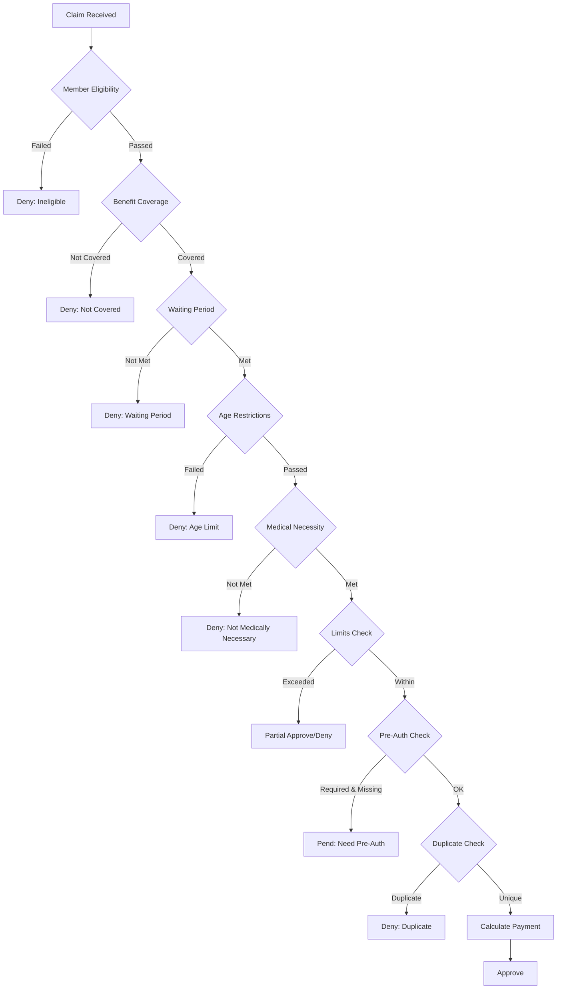

# Comprehensive Health Insurance Claims Business Rules v1.0

## Executive Summary

This document defines all business rules for processing health insurance claims based on the 150+ benefit configurations specified in Benefit_Plan.md. These rules ensure accurate, consistent, and compliant claims adjudication for a world-class health insurance system.

---

## Table of Contents

1. [Inpatient Rules](#1-inpatient-rules)
2. [Outpatient Rules](#2-outpatient-rules)  
3. [Dental Care Rules](#3-dental-care-rules)
4. [Optical/Eyeglasses Rules](#4-opticaleyeglasses-rules)
5. [Maternity Rules](#5-maternity-rules)
6. [Validation Sequences](#6-validation-sequences)
7. [Accumulator Management](#7-accumulator-management)
8. [Financial Controls](#8-financial-controls)

---

## 1. INPATIENT RULES

### 1.1 Claim Settlement Percentages

| Settlement % | Description | Member Pays | Insurer Pays |
|-------------|-------------|-------------|--------------|
| 100% | Full coverage | 0% | 100% |
| 95% | High coverage | 5% | 95% |
| 90% | Standard coverage | 10% | 90% |
| 85% | Basic plus | 15% | 85% |
| 80% | Basic coverage | 20% | 80% |

**Calculation Formula:**
```
allowed_amount = min(billed_amount, benefit_limit)
insurer_payment = allowed_amount × (settlement_pct / 100)
member_liability = allowed_amount - insurer_payment
```

### 1.2 Claim Excess Rules

| Type | Description | Handling |
|------|-------------|----------|
| Standard | Normal excess handling | Apply limits strictly |
| Any Cause | Cover excess for any reason | Draw from buffer fund |
| Except Exception | Cover except specific exclusions | Check exclusion list |
| Except Exception & Non-Medical | Strictest control | Deny non-medical items |

### 1.3 Recovery Period Rules

| Period | Description | Validation |
|--------|-------------|------------|
| Standard | 14 days between admissions | Check previous admission dates |
| 0 days | No recovery period required | Allow immediate readmission |
| 7 days | One week recovery | Minimum 7 days between admissions |
| 10 days | Ten days recovery | Minimum 10 days between admissions |
| 14 days | Two weeks recovery | Standard recovery period |
| 30 days | One month recovery | Strictest recovery requirement |

### 1.4 Room & Board Charges

**Coverage Limits:**
- Maximum days per year: 60, 90, 120, 180, 360, 365 days
- Daily limit amount varies by plan tier

**Validation Rules:**
```python
def validate_room_charges(days_claimed, days_used_ytd, max_days_per_year, daily_limit):
    if days_used_ytd + days_claimed > max_days_per_year:
        return DENY("Annual room limit exceeded")
    if daily_rate > daily_limit:
        return PARTIAL_APPROVE(daily_limit)
    return APPROVE()
```

### 1.5 ICU/CCU Charges

**Coverage Options:**
- Not covered
- 10, 20, 30, 60, 90, 120, 180 days maximum
- Same limits as regular room

**Special Rules:**
- ICU requires medical justification
- Automatic step-down review after 7 days
- Daily rate typically 2-3x room rate

### 1.6 Surgery Classifications & Charges

#### Surgery Hierarchy:
1. **Complex Surgery**: 
   - Surgeon: 65% of limit
   - OR: 20% of limit
   - Anesthesia: 15% of limit

2. **Major Surgery**:
   - Surgeon: 60% of limit
   - OR: 25% of limit
   - Anesthesia: 15% of limit

3. **Medium Surgery**:
   - Surgeon: 60% of limit
   - OR: 25% of limit
   - Anesthesia: 15% of limit

4. **Minor Surgery**:
   - Surgeon: 70% of limit
   - OR: 20% of limit
   - Anesthesia: 10% of limit

#### Multiple Surgery Rules:
- Primary procedure: 100% of allowed
- Secondary procedure: 50% of allowed
- Additional procedures: 25% of allowed each
- Maximum surgeries per case: 1, 3, 4, or 12 based on plan

### 1.7 Pre & Post Hospitalization

#### Pre-Hospitalization Coverage:

| Coverage Type | Window | What's Covered |
|--------------|--------|----------------|
| Not Covered | N/A | Nothing |
| Per Case - 30 days | 30 days before admission | Related medical expenses |
| Per Case - 31 days | 31 days before admission | Related medical expenses |
| Per Year - 30 days | 30 days before, annual limit | Related medical expenses |
| Per Year - 90 days | 90 days before, annual limit | Extended coverage |

#### Post-Hospitalization Coverage:

| Coverage Type | Window | What's Covered |
|--------------|--------|----------------|
| Not Covered | N/A | Nothing |
| Per Case - 30 days | 30 days after discharge | Follow-up care |
| Per Case - 60 days | 60 days after discharge | Extended follow-up |
| Per Case - 90 days | 90 days after discharge | Long-term follow-up |

**Validation Logic:**
```python
def validate_pre_post_hosp(service_date, admission_date, discharge_date, pre_days, post_days):
    if pre_days > 0:
        pre_window_start = admission_date - timedelta(days=pre_days)
        if service_date < pre_window_start or service_date > admission_date:
            return DENY("Outside pre-hospitalization window")
    
    if post_days > 0:
        post_window_end = discharge_date + timedelta(days=post_days)
        if service_date < discharge_date or service_date > post_window_end:
            return DENY("Outside post-hospitalization window")
    
    return APPROVE()
```

### 1.8 Special Inpatient Benefits

#### Circumcision Rules:
- Coverage options:
  - Not covered
  - Medical indication only (age ≤5)
  - Medical indication only (all ages)
  - All circumcisions (age >5)
  - All circumcisions (age >10)
  - All circumcisions (all ages)

**Required Diagnoses for Medical Indication:**
- N47.0: Adherent prepuce
- N47.1: Phimosis
- N47.8: Other disorders of prepuce

#### Hernia Surgery Rules:
- Non-congenital only vs all hernias
- Age restrictions: >5 years, >10 years, or all ages
- Coverage: In surgery costs vs separate benefit

#### Medical Equipment Rental:
- Covered in hospital costs (standard)
- Covered in surgery
- Separate annual benefit
- Per case benefit

#### Implantable Devices:
- Pacemakers, stents, prosthetics
- Coverage in surgery costs vs separate limit
- Pre-authorization required for items >10M IDR

---

## 2. OUTPATIENT RULES

### 2.1 Claim Settlement
- Standard: 100% reimbursement
- Excess claims paid at provider

### 2.2 Consultation Fees

| Type | Coverage Options | Limits |
|------|-----------------|--------|
| General Practitioner | Per visit/day/year | Varies by plan |
| Specialist | Per visit/day/year | Higher limits |
| Package (Doctor + Meds) | Per visit | Bundled limit |

### 2.3 Diagnostic Tests

**Coverage Types:**
- Per day: Maximum tests per day
- Per visit: Tests per consultation
- Per year: Annual limit

**Common Tests Covered:**
- Laboratory: CBC, Chemistry, Urinalysis
- Radiology: X-ray, Ultrasound, CT (with PA)
- Special: MRI (requires pre-auth)

### 2.4 Medication Coverage

| Coverage Type | Description | Validation |
|--------------|-------------|------------|
| Not Covered | No medication benefits | Deny all pharmacy claims |
| Per Visit | Fixed amount per visit | Check visit association |
| Per Day | Daily medication limit | Aggregate daily claims |
| Per Year | Annual medication limit | Check accumulator |

**Formulary Rules:**
- Generic substitution mandatory unless medical necessity
- Brand names require justification
- Excluded: Vitamins (unless prescribed), cosmetic drugs

### 2.5 Physiotherapy

- Coverage: Per visit or per year
- Requires referral from specialist
- Maximum sessions: 10, 20, or 30 per year
- Progress review every 5 sessions

### 2.6 Immunization

**Age-Based Rules:**
| Age Group | Coverage | Vaccines |
|-----------|----------|----------|
| ≤5 years | Full coverage | All childhood vaccines |
| >5 years | Limited | Flu, special cases |
| All ages | Varies | Based on plan |

### 2.7 Special Outpatient Benefits

#### One-Day Surgery:
- Procedures <24 hours
- No overnight stay
- Lower limits than inpatient surgery
- Common: Cataract, endoscopy, minor procedures

#### Medical Check-ups:
- Annual wellness benefit
- Age-based packages
- Preventive focus

---

## 3. DENTAL CARE RULES

### 3.1 Classification System

| Category | Procedures | Coverage |
|----------|------------|----------|
| Preventive | Cleaning, fluoride, X-rays | 100% coverage |
| Basic | Fillings, extractions | 80% coverage |
| Complex | Crowns, bridges, dentures | 50% coverage |

### 3.2 Coverage Limits

- Per visit: Fixed amount per dental visit
- Per year: Annual maximum benefit
- Waiting period: 3-6 months for basic, 12 months for complex

### 3.3 Exclusions

- Cosmetic dentistry
- Orthodontics (unless medically necessary)
- Implants (varies by plan)
- Wisdom teeth (plan-specific)

---

## 4. OPTICAL/EYEGLASSES RULES

### 4.1 Coverage Components

| Component | Frequency | Limit |
|-----------|-----------|-------|
| Frames | Annual or biennial | Fixed amount |
| Lenses | Annual | Separate or combined |
| Contact Lenses | Annual | Alternative to glasses |
| Eye Exam | Annual | Included or separate |

### 4.2 Validation Rules

```python
def validate_optical_claim(last_claim_date, coverage_frequency):
    if coverage_frequency == "annual":
        min_gap_days = 365
    elif coverage_frequency == "biennial":
        min_gap_days = 730
    
    days_since_last = (current_date - last_claim_date).days
    if days_since_last < min_gap_days:
        return DENY(f"Minimum {coverage_frequency} gap not met")
    
    return APPROVE()
```

---

## 5. MATERNITY RULES

### 5.1 Coverage Types

| Type | Coverage | Requirements |
|------|----------|--------------|
| Normal Delivery | Per year | 9-month waiting period |
| Caesarean | Per year | 12-month waiting period |
| Miscarriage | Per year | Medical indication |
| Complications | Per case | No waiting period |

### 5.2 Prenatal Care

- Check-ups: Monthly/per visit
- Ultrasounds: 3-4 per pregnancy
- Lab tests: Covered per trimester
- Medications: Vitamins included

### 5.3 Delivery Packages

**Normal Delivery Package:**
- Room: 3 days
- Delivery costs
- Newborn care
- Medications

**C-Section Package:**
- Room: 4-5 days
- Surgery costs
- Extended recovery
- Higher limits

---

## 6. VALIDATION SEQUENCES

### 6.1 Standard Validation Flow



### 6.2 Parallel Validation Rules

Run simultaneously for efficiency:
1. Eligibility checks
2. Benefit mapping
3. Accumulator queries
4. Duplicate detection
5. Pre-auth verification

### 6.3 Override Authority Levels

| Level | Role | Can Override |
|-------|------|--------------|
| 1 | Claims Processor | Warnings only |
| 2 | Senior Processor | Minor denials |
| 3 | Supervisor | Most denials |
| 4 | Medical Director | Medical necessity |
| 5 | VP Claims | All rules |

---

## 7. ACCUMULATOR MANAGEMENT

### 7.1 Accumulator Types

| Type | Description | Reset |
|------|-------------|-------|
| Benefit-Specific | Per benefit annual max | Calendar/Policy year |
| Deductible | Member cost-sharing | Annual |
| Out-of-Pocket Max | Total member liability | Annual |
| Family Aggregate | Combined family limits | Annual |
| Lifetime Max | Career limits | Never |

### 7.2 Accumulator Updates

```python
def update_accumulators(claim):
    # Update benefit-specific
    benefit_acc = get_accumulator(claim.member_id, claim.benefit_code, claim.year)
    benefit_acc.used += claim.approved_amount
    
    # Update deductible
    if claim.deductible_applied > 0:
        deduct_acc = get_deductible_accumulator(claim.member_id, claim.year)
        deduct_acc.used += claim.deductible_applied
    
    # Update out-of-pocket
    oop_acc = get_oop_accumulator(claim.member_id, claim.year)
    oop_acc.used += claim.member_liability
    
    # Check family aggregates
    update_family_accumulators(claim)
    
    return save_accumulators()
```

### 7.3 Cross-Accumulation Rules

Some benefits share limits:
- Room & Board + Nursing Care
- All surgeries combined
- All outpatient consultations
- Dental preventive + basic

---

## 8. FINANCIAL CONTROLS

### 8.1 ASO (Administrative Services Only) Funds

**Validation Steps:**
1. Check ASO applicability
2. Verify fund balance
3. Calculate required amount
4. Reserve funds
5. Process payment
6. Update balance

**Insufficient Funds Handling:**
```python
def handle_aso_insufficient_funds(claim, required_amount, available_balance):
    if available_balance > 0:
        # Partial payment
        partial_payment = available_balance
        remaining = required_amount - available_balance
        pend_claim(claim, f"ASO funds insufficient. Need {remaining} more")
        notify_employer(claim.group_id, remaining)
    else:
        # Full pend
        pend_claim(claim, f"No ASO funds available. Need {required_amount}")
        urgent_notify_employer(claim.group_id, required_amount)
```

### 8.2 Buffer Fund Management

**Usage Priority:**
1. Regular benefit limit
2. ASO funds (if applicable)
3. Buffer fund (if allow_excess_draw = true)
4. Non-benefit fund (last resort)

**Buffer Monitoring:**
- Alert at 75% utilization
- Warning at 90% utilization
- Stop at 100% unless override

### 8.3 Coinsurance Calculations

**Standard Calculation:**
```python
def calculate_coinsurance(allowed_amount, coinsurance_pct, oop_remaining):
    member_coins = allowed_amount * (coinsurance_pct / 100)
    
    # Apply out-of-pocket maximum
    if member_coins > oop_remaining:
        member_coins = oop_remaining
    
    insurer_pays = allowed_amount - member_coins
    
    return {
        "member_liability": member_coins,
        "insurer_payment": insurer_pays,
        "applied_to_oop": member_coins
    }
```

---

## 9. SPECIAL SCENARIOS

### 9.1 Emergency Claims

**Override Rules:**
- Bypass pre-auth requirement
- Extend time limits for submission
- Allow out-of-network at in-network rates
- 72-hour retro-authorization window

### 9.2 Newborn Coverage

- Automatic coverage for 30 days
- Must add to policy within 30 days
- Retroactive to birth date
- No waiting periods apply

### 9.3 Coordination of Benefits (COB)

**Primary/Secondary Determination:**
1. Employee's plan primary over spouse's
2. Birthday rule for children
3. Court order overrides
4. Active over retiree

### 9.4 Subrogation/Third-Party Liability

**Process:**
1. Identify potential TPL
2. Pay claim normally
3. Pursue recovery
4. Credit member if recovered

---

## 10. AUDIT & COMPLIANCE

### 10.1 Audit Triggers

- Claims >50M IDR
- Multiple surgeries same day
- Unusual diagnosis/procedure combinations
- Provider outlier patterns
- Member frequency outliers

### 10.2 Compliance Requirements

- Document retention: 7 years
- Privacy protection: Encrypt PHI
- Regulatory reporting: Monthly to OJK
- Appeal rights: 30 days
- Payment timelines: 5 business days

---

## APPENDIX A: Reason Codes

| Code | Description | Category |
|------|-------------|----------|
| ELIG001 | Member not eligible | Eligibility |
| ELIG002 | Coverage terminated | Eligibility |
| BEN001 | Benefit not covered | Benefits |
| BEN002 | Benefit limit exceeded | Benefits |
| MED001 | Not medically necessary | Medical |
| MED002 | Experimental treatment | Medical |
| DOC001 | Missing documentation | Documentation |
| DOC002 | Invalid documentation | Documentation |
| DUP001 | Duplicate claim | Duplicate |
| PA001 | Pre-auth required | Authorization |
| PA002 | Pre-auth denied | Authorization |

---

## APPENDIX B: Quick Reference Tables

### Maximum Days Coverage

| Benefit | Options (days) |
|---------|---------------|
| Room & Board | 60, 90, 120, 180, 360, 365 |
| ICU/CCU | 10, 20, 30, 60, 90, 120, 180 |
| Private Nurse | 90, 120, 180, 360, 365 |
| Recovery Period | 0, 7, 10, 14, 30 |

### Age-Based Restrictions

| Benefit | Age Limits |
|---------|------------|
| Circumcision (Medical) | ≤5 or all ages |
| Hernia Surgery | >5, >10, or all ages |
| Immunization | ≤5 or all ages |
| Pediatric Benefits | <18 |
| Geriatric Benefits | >60 |

---

*Document Version: 1.0*
*Last Updated: August 2025*
*Next Review: February 2026*