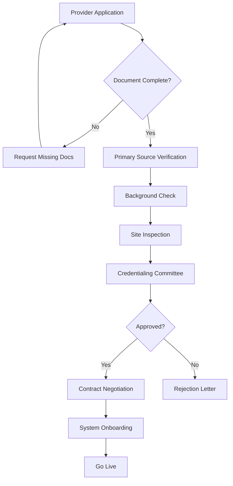

# Claims — Provider Network Management System (v0.1)

**Purpose**: Complete design for provider credentialing, contracting, network management, and performance monitoring
**Date**: 2025-08-14
**Owner**: Provider Network & Medical Affairs
**Status**: Initial Design

---

## 1. EXECUTIVE SUMMARY

Provider Network Management is the backbone of health insurance operations, ensuring quality care delivery while controlling costs. This document defines the complete provider lifecycle management system from initial credentialing through performance monitoring and contract renewal.

---

## 2. PROVIDER ONBOARDING & CREDENTIALING

### 2.1 Provider Types & Categories
```yaml
Provider_Types:
  Institutional:
    - Hospitals (RS Type A/B/C/D)
    - Clinics (Klinik Pratama/Utama)
    - Diagnostic Centers
    - Pharmacies
    - Rehabilitation Centers
    - Home Health Agencies
    
  Professional:
    - Primary Care Physicians
    - Specialists
    - Dentists
    - Allied Health (Nurses, Therapists)
    - Traditional Medicine Practitioners
```

### 2.2 Credentialing Requirements
```yaml
Document_Requirements:
  Institutional:
    - Business License (SIUP/NIB)
    - Health Facility License (Izin RS/Klinik)
    - Tax ID (NPWP)
    - Accreditation Certificate (KARS/JCI)
    - Fire Safety Certificate
    - Environmental Permit
    - Insurance Coverage
    
  Professional:
    - Medical License (STR)
    - Practice License (SIP)
    - Specialty Board Certification
    - Malpractice Insurance
    - CV and References
    - Conflict of Interest Declaration
```

### 2.3 Credentialing Workflow


### 2.4 Database Schema
```sql
-- Provider master data
CREATE TABLE provider.provider_master (
    provider_id UUID PRIMARY KEY DEFAULT gen_random_uuid(),
    provider_type VARCHAR(50) NOT NULL,
    tax_id VARCHAR(30) UNIQUE,
    business_name VARCHAR(200) NOT NULL,
    dba_name VARCHAR(200),
    established_date DATE,
    ownership_type VARCHAR(50),
    bed_capacity INTEGER,
    specialties TEXT[],
    languages_supported TEXT[],
    created_at TIMESTAMPTZ DEFAULT NOW(),
    updated_at TIMESTAMPTZ DEFAULT NOW()
);

-- Provider locations
CREATE TABLE provider.provider_location (
    location_id UUID PRIMARY KEY DEFAULT gen_random_uuid(),
    provider_id UUID REFERENCES provider.provider_master,
    location_type VARCHAR(50), -- main, branch, satellite
    address_line1 VARCHAR(200),
    address_line2 VARCHAR(200),
    city VARCHAR(100),
    province VARCHAR(100),
    postal_code VARCHAR(10),
    latitude DECIMAL(10,8),
    longitude DECIMAL(11,8),
    phone VARCHAR(20),
    fax VARCHAR(20),
    email VARCHAR(100),
    operating_hours JSONB,
    emergency_available BOOLEAN DEFAULT false,
    wheelchair_accessible BOOLEAN DEFAULT false
);

-- Credentialing tracking
CREATE TABLE provider.credentialing (
    credential_id UUID PRIMARY KEY DEFAULT gen_random_uuid(),
    provider_id UUID REFERENCES provider.provider_master,
    credential_type VARCHAR(50),
    document_name VARCHAR(200),
    issue_date DATE,
    expiry_date DATE,
    issuing_authority VARCHAR(200),
    verification_status VARCHAR(50),
    verification_date DATE,
    verified_by UUID,
    document_url TEXT,
    alerts_enabled BOOLEAN DEFAULT true,
    alert_days_before INTEGER DEFAULT 90
);

-- Provider practitioners (for institutions)
CREATE TABLE provider.provider_practitioner (
    practitioner_id UUID PRIMARY KEY DEFAULT gen_random_uuid(),
    provider_id UUID REFERENCES provider.provider_master,
    npi VARCHAR(20),
    str_number VARCHAR(50),
    sip_number VARCHAR(50),
    full_name VARCHAR(200),
    specialty VARCHAR(100),
    sub_specialty VARCHAR(100),
    privileges JSONB,
    schedule JSONB,
    consultation_fee DECIMAL(12,2),
    active BOOLEAN DEFAULT true
);
```

---

## 3. CONTRACT MANAGEMENT

### 3.1 Contract Types
```yaml
Payment_Models:
  Fee_For_Service:
    - Standard fee schedule
    - Percentage of charges
    - Per diem rates
    
  Capitation:
    - PMPM rates by age/gender
    - Risk adjustment factors
    - Quality bonuses
    
  Bundled_Payment:
    - DRG-based (INA-CBG)
    - Episode-based
    - Maternity packages
    
  Pay_For_Performance:
    - Quality metrics
    - Efficiency targets
    - Patient satisfaction
```

### 3.2 Rate Negotiation Framework
```sql
CREATE TABLE provider.contract (
    contract_id UUID PRIMARY KEY DEFAULT gen_random_uuid(),
    provider_id UUID REFERENCES provider.provider_master,
    contract_number VARCHAR(50) UNIQUE,
    contract_type VARCHAR(50),
    payment_model VARCHAR(50),
    effective_date DATE NOT NULL,
    termination_date DATE,
    auto_renewal BOOLEAN DEFAULT false,
    renewal_notice_days INTEGER DEFAULT 90,
    status VARCHAR(50) DEFAULT 'draft'
);

CREATE TABLE provider.contract_rates (
    rate_id UUID PRIMARY KEY DEFAULT gen_random_uuid(),
    contract_id UUID REFERENCES provider.contract,
    service_type VARCHAR(100),
    service_code VARCHAR(50),
    rate_type VARCHAR(50), -- fixed, percentage, per_diem
    base_rate DECIMAL(12,2),
    multiplier DECIMAL(5,3) DEFAULT 1.0,
    max_allowable DECIMAL(12,2),
    effective_date DATE,
    end_date DATE
);

CREATE TABLE provider.contract_terms (
    term_id UUID PRIMARY KEY DEFAULT gen_random_uuid(),
    contract_id UUID REFERENCES provider.contract,
    term_category VARCHAR(50),
    term_description TEXT,
    penalty_amount DECIMAL(12,2),
    penalty_type VARCHAR(50) -- fixed, percentage
);
```

### 3.3 Network Tier Management
```yaml
Network_Tiers:
  Tier_1_Premium:
    - Major hospitals
    - Centers of excellence
    - No referral required
    - Highest reimbursement
    
  Tier_2_Preferred:
    - Quality providers
    - Good outcomes
    - Standard reimbursement
    
  Tier_3_Standard:
    - Basic network
    - Referral required
    - Lower reimbursement
    
  Out_of_Network:
    - Emergency only
    - Member pays difference
```

---

## 4. NETWORK ADEQUACY MONITORING

### 4.1 Access Standards
```sql
CREATE TABLE provider.network_adequacy_standard (
    standard_id UUID PRIMARY KEY DEFAULT gen_random_uuid(),
    provider_type VARCHAR(50),
    specialty VARCHAR(100),
    urban_time_minutes INTEGER,
    urban_distance_km DECIMAL(5,2),
    rural_time_minutes INTEGER,
    rural_distance_km DECIMAL(5,2),
    minimum_providers_per_1000 DECIMAL(5,2)
);

CREATE TABLE provider.network_adequacy_analysis (
    analysis_id UUID PRIMARY KEY DEFAULT gen_random_uuid(),
    analysis_date DATE,
    region VARCHAR(100),
    provider_type VARCHAR(50),
    specialty VARCHAR(100),
    total_members INTEGER,
    total_providers INTEGER,
    providers_per_1000 DECIMAL(5,2),
    avg_distance_km DECIMAL(5,2),
    avg_wait_days INTEGER,
    gap_identified BOOLEAN,
    action_plan TEXT
);
```

### 4.2 Geo-Access Analysis
```python
def calculate_network_adequacy(member_location, provider_type, specialty=None):
    """
    Calculate if network meets adequacy standards for member location
    """
    standards = get_adequacy_standards(provider_type, specialty)
    nearby_providers = find_providers_within_radius(
        member_location, 
        standards.max_distance_km
    )
    
    adequacy_score = {
        'meets_distance': len(nearby_providers) > 0,
        'meets_ratio': calculate_provider_ratio(nearby_providers, member_count),
        'avg_distance': calculate_avg_distance(member_location, nearby_providers),
        'next_available_appointment': get_next_appointment(nearby_providers),
        'alternative_access': check_telemedicine_availability(provider_type)
    }
    
    return adequacy_score
```

---

## 5. PROVIDER PERFORMANCE MANAGEMENT

### 5.1 Quality Metrics
```sql
CREATE TABLE provider.quality_metrics (
    metric_id UUID PRIMARY KEY DEFAULT gen_random_uuid(),
    metric_code VARCHAR(50) UNIQUE,
    metric_name VARCHAR(200),
    metric_category VARCHAR(100),
    metric_type VARCHAR(50), -- structure, process, outcome
    calculation_method TEXT,
    benchmark_source VARCHAR(100),
    weight DECIMAL(5,2)
);

CREATE TABLE provider.provider_performance_score (
    score_id UUID PRIMARY KEY DEFAULT gen_random_uuid(),
    provider_id UUID REFERENCES provider.provider_master,
    measurement_period DATE,
    metric_id UUID REFERENCES provider.quality_metrics,
    numerator INTEGER,
    denominator INTEGER,
    score DECIMAL(5,2),
    percentile_rank INTEGER,
    trend VARCHAR(20), -- improving, stable, declining
    action_required BOOLEAN DEFAULT false
);
```

### 5.2 Performance Dashboard Metrics
```yaml
Clinical_Quality:
  - Readmission rates
  - Hospital-acquired infection rates
  - Mortality rates (risk-adjusted)
  - Clinical guideline adherence
  - Medication error rates
  
Operational_Efficiency:
  - Average length of stay
  - ER wait times
  - Appointment availability
  - Claims submission accuracy
  - Prior auth response time
  
Financial_Performance:
  - Cost per case (risk-adjusted)
  - Generic drug utilization
  - Unnecessary readmissions cost
  - Claims denial rate
  - Payment accuracy
  
Member_Satisfaction:
  - NPS scores
  - Complaint rates
  - Communication ratings
  - Facility ratings
  - Would recommend percentage
```

### 5.3 Provider Scorecards
```sql
CREATE TABLE provider.provider_scorecard (
    scorecard_id UUID PRIMARY KEY DEFAULT gen_random_uuid(),
    provider_id UUID REFERENCES provider.provider_master,
    period_start DATE,
    period_end DATE,
    overall_score DECIMAL(5,2),
    quality_score DECIMAL(5,2),
    efficiency_score DECIMAL(5,2),
    satisfaction_score DECIMAL(5,2),
    network_tier_current VARCHAR(50),
    network_tier_recommended VARCHAR(50),
    incentive_earned DECIMAL(12,2),
    penalty_applied DECIMAL(12,2),
    improvement_areas JSONB
);
```

---

## 6. PROVIDER PORTAL & SELF-SERVICE

### 6.1 Portal Features
```yaml
Provider_Portal:
  Administrative:
    - Profile management
    - Practitioner roster
    - Location/hours updates
    - Document upload
    - Contract viewing
    
  Clinical:
    - Eligibility verification
    - Prior authorization submission
    - Referral management
    - Care gap alerts
    - Clinical guidelines
    
  Financial:
    - Claims submission
    - Payment history
    - Remittance advice
    - Fee schedule lookup
    - Performance incentives
    
  Communication:
    - Secure messaging
    - Announcements
    - Training materials
    - Policy updates
```

### 6.2 API Specifications
```yaml
Provider_APIs:
  /provider/eligibility:
    method: POST
    request:
      member_id: string
      service_date: date
      service_codes: array
    response:
      eligible: boolean
      benefits: array
      copay: number
      remaining_benefits: object
      
  /provider/prior-auth:
    method: POST
    request:
      member_id: string
      diagnosis_codes: array
      procedure_codes: array
      clinical_notes: string
    response:
      auth_number: string
      status: string
      approved_services: array
      denied_services: array
      
  /provider/claims:
    method: POST
    request:
      claim_type: string
      member_id: string
      service_lines: array
      attachments: array
    response:
      claim_id: string
      status: string
      expected_payment: number
```

---

## 7. PROVIDER COMMUNICATION & ENGAGEMENT

### 7.1 Communication Framework
```yaml
Communication_Channels:
  Regular_Updates:
    - Monthly newsletters
    - Policy change notifications
    - Payment updates
    - Quality report cards
    
  Training_Programs:
    - New provider orientation
    - System training
    - Clinical guidelines updates
    - Compliance training
    
  Provider_Relations:
    - Dedicated account managers
    - Regular facility visits
    - Issue resolution tracking
    - Satisfaction surveys
```

### 7.2 Provider Support Structure
```sql
CREATE TABLE provider.support_ticket (
    ticket_id UUID PRIMARY KEY DEFAULT gen_random_uuid(),
    provider_id UUID REFERENCES provider.provider_master,
    category VARCHAR(100),
    priority VARCHAR(20),
    subject TEXT,
    description TEXT,
    status VARCHAR(50),
    assigned_to UUID,
    created_at TIMESTAMPTZ DEFAULT NOW(),
    resolved_at TIMESTAMPTZ,
    resolution TEXT,
    satisfaction_rating INTEGER
);
```

---

## 8. MONITORING & ANALYTICS

### 8.1 Provider Network KPIs
```yaml
Network_KPIs:
  Growth_Metrics:
    - New providers per month
    - Network growth rate
    - Geographic coverage expansion
    - Specialty gap closure
    
  Quality_Metrics:
    - Average provider quality score
    - High-performer percentage
    - Quality improvement rate
    
  Operational_Metrics:
    - Credentialing TAT
    - Contract renewal rate
    - Provider retention rate
    - Portal adoption rate
    
  Financial_Metrics:
    - Network cost trend
    - Payment accuracy rate
    - Value-based contract percentage
    - Cost savings achieved
```

### 8.2 Outlier Detection
```python
def detect_provider_outliers():
    """
    Identify providers with unusual patterns
    """
    outliers = {
        'high_cost': identify_cost_outliers(),
        'poor_quality': identify_quality_outliers(),
        'high_utilization': identify_utilization_outliers(),
        'billing_anomalies': identify_billing_patterns(),
        'member_complaints': identify_complaint_patterns()
    }
    
    for provider_id, issues in outliers.items():
        create_intervention_plan(provider_id, issues)
        notify_provider_relations(provider_id, issues)
    
    return outliers
```

---

## 9. REGULATORY COMPLIANCE

### 9.1 Provider Compliance Requirements
```yaml
Regulatory_Requirements:
  Licensing:
    - Valid licenses maintenance
    - Timely renewal tracking
    - Multi-location compliance
    
  Reporting:
    - Quality measure submission
    - Incident reporting
    - Infection control reports
    
  Standards:
    - Clinical practice guidelines
    - Safety protocols
    - Privacy requirements
```

### 9.2 Audit Framework
```sql
CREATE TABLE provider.compliance_audit (
    audit_id UUID PRIMARY KEY DEFAULT gen_random_uuid(),
    provider_id UUID REFERENCES provider.provider_master,
    audit_type VARCHAR(100),
    audit_date DATE,
    auditor_id UUID,
    findings JSONB,
    risk_level VARCHAR(20),
    corrective_actions JSONB,
    follow_up_date DATE,
    status VARCHAR(50)
);
```

---

## 10. IMPLEMENTATION ROADMAP

### Phase 1 (Weeks 1-4): Foundation
- Database schema implementation
- Basic credentialing workflow
- Provider master data migration

### Phase 2 (Weeks 5-8): Contracting
- Contract management system
- Rate table implementation
- Network tier assignment

### Phase 3 (Weeks 9-12): Portal
- Provider portal development
- API implementation
- Self-service features

### Phase 4 (Weeks 13-16): Analytics
- Performance measurement
- Quality scorecards
- Network adequacy monitoring

---

**Related Documents**: 
- Claims PRD — Core & Journey
- Claims — Gap Analysis & Recommendations
- Claims — Data Model, APIs & Events