# Process Flow Diagrams — Complete System Workflows (v0.1)

**Purpose**: Detailed process flows for all critical system operations
**Date**: 2025-08-14
**Owner**: Business Process, Operations, Technology
**Status**: Process Architecture

---

## 1. MEMBER JOURNEY FLOWS

### 1.1 End-to-End Claim Journey (Network Provider)
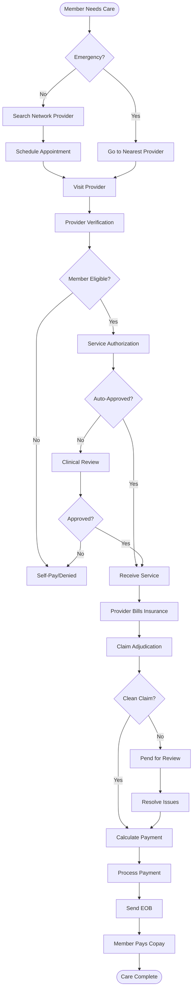

### 1.2 Out-of-Network Reimbursement Flow
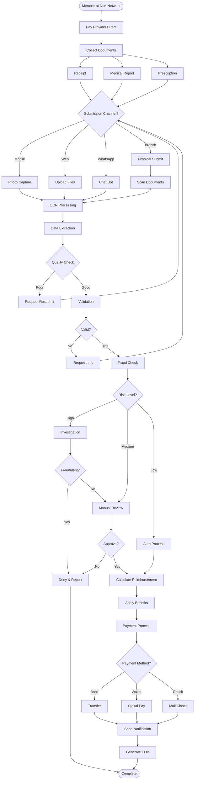

### 1.3 Pre-Authorization Journey
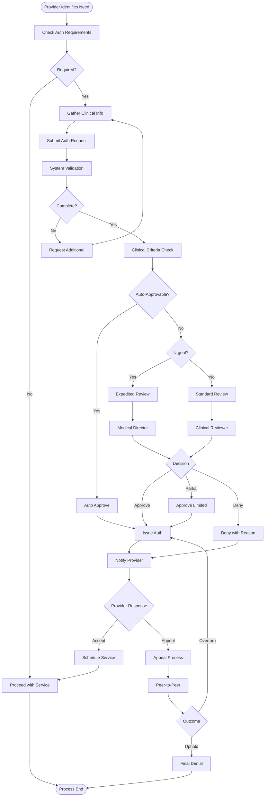

---

## 2. PROVIDER WORKFLOWS

### 2.1 Provider Onboarding & Credentialing
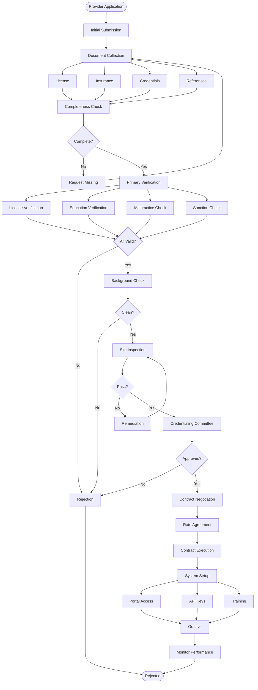

### 2.2 Provider Claim Submission
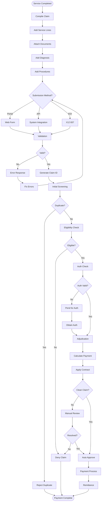

---

## 3. OPERATIONAL WORKFLOWS

### 3.1 Real-Time Authorization Engine
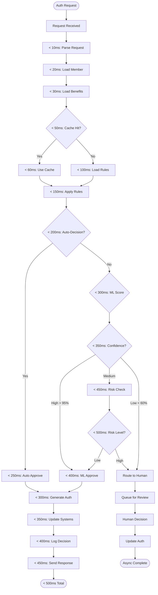

### 3.2 Fraud Detection Pipeline
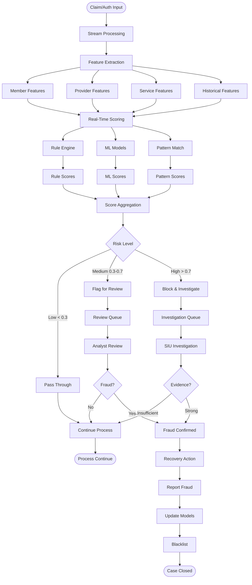

### 3.3 Payment Processing Flow
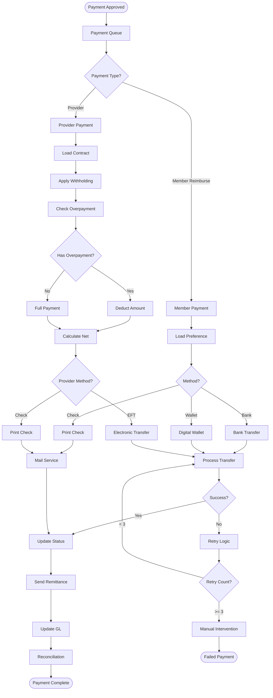

---

## 4. SYSTEM INTEGRATION FLOWS

### 4.1 Multi-System Data Flow
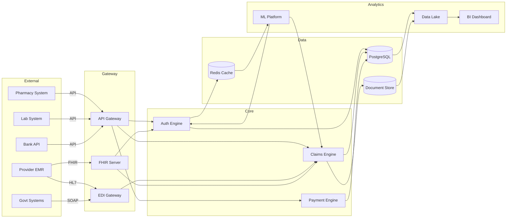

### 4.2 Event-Driven Architecture
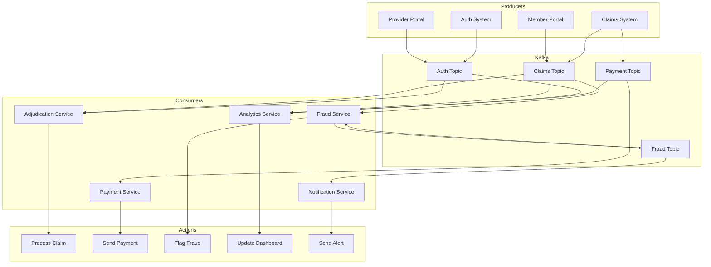

---

## 5. DECISION TREES

### 5.1 Claim Adjudication Decision Tree
```
Start: Claim Received
│
├─ Is Member Active?
│  ├─ No → Deny (Inactive Member)
│  └─ Yes ↓
│
├─ Is Provider In-Network?
│  ├─ No → Apply OON Benefits
│  │  ├─ Emergency? → Apply In-Network Rates
│  │  └─ Non-Emergency → Apply OON Rates (typically 60-70%)
│  └─ Yes ↓
│
├─ Is Service Covered?
│  ├─ No → Check Exclusions
│  │  ├─ Absolute Exclusion → Deny
│  │  └─ Conditional → Review Clinical Notes
│  └─ Yes ↓
│
├─ Prior Auth Required?
│  ├─ Yes → Check Auth Status
│  │  ├─ Not Authorized → Deny (No Auth)
│  │  ├─ Expired → Pend for Review
│  │  └─ Valid → Continue ↓
│  └─ No ↓
│
├─ Within Benefit Limits?
│  ├─ No → Apply Limits
│  │  ├─ Allow Excess? → Draw from Buffer
│  │  └─ No Excess → Cap at Limit
│  └─ Yes ↓
│
├─ Deductible Met?
│  ├─ No → Apply Deductible
│  └─ Yes ↓
│
├─ Calculate Copay/Coinsurance
│  ├─ Copay → Fixed Amount
│  └─ Coinsurance → Percentage
│
├─ COB Applicable?
│  ├─ Yes → Coordinate Benefits
│  │  ├─ Primary → Process Full
│  │  └─ Secondary → Process Balance
│  └─ No ↓
│
└─ Final Payment Calculation
   ├─ Plan Pays: Allowed - Member Responsibility
   └─ Member Pays: Copay + Coinsurance + Deductible
```

### 5.2 Reimbursement Decision Tree
```
Start: Reimbursement Request
│
├─ Documents Complete?
│  ├─ No → Request Missing Documents
│  │  ├─ Receipt Missing → Request Receipt
│  │  ├─ Medical Report Missing → Request Report
│  │  └─ Prescription Missing → Request Rx
│  └─ Yes ↓
│
├─ Document Quality Check
│  ├─ OCR Confidence < 80% → Manual Review
│  └─ OCR Confidence ≥ 80% ↓
│
├─ Provider Verification
│  ├─ Provider Not Found → Investigation
│  ├─ Provider Blacklisted → Deny
│  └─ Provider Valid ↓
│
├─ Service Date Check
│  ├─ > 90 days → Late Submission
│  │  ├─ Valid Reason? → Accept
│  │  └─ No Reason → Deny
│  └─ ≤ 90 days ↓
│
├─ Duplicate Check
│  ├─ Duplicate Found → Deny (Duplicate)
│  └─ No Duplicate ↓
│
├─ Amount Validation
│  ├─ Amount > UCR → Apply UCR Limit
│  └─ Amount ≤ UCR ↓
│
├─ Fraud Risk Score
│  ├─ High (>0.7) → SIU Investigation
│  ├─ Medium (0.3-0.7) → Enhanced Review
│  └─ Low (<0.3) ↓
│
├─ Calculate Reimbursement
│  ├─ Network Rate Available? → Use Network Rate
│  └─ No Network Rate → Use UCR (80th percentile)
│
└─ Process Payment
   ├─ Bank Transfer → Same Day
   ├─ Digital Wallet → Instant
   └─ Check → 5-7 Days
```

---

## 6. STATE MACHINES

### 6.1 Claim State Machine
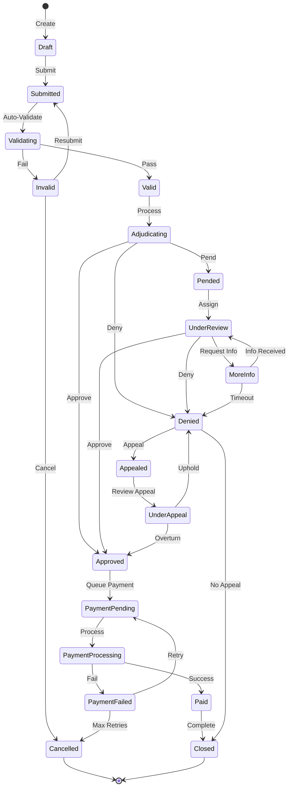

### 6.2 Authorization State Machine
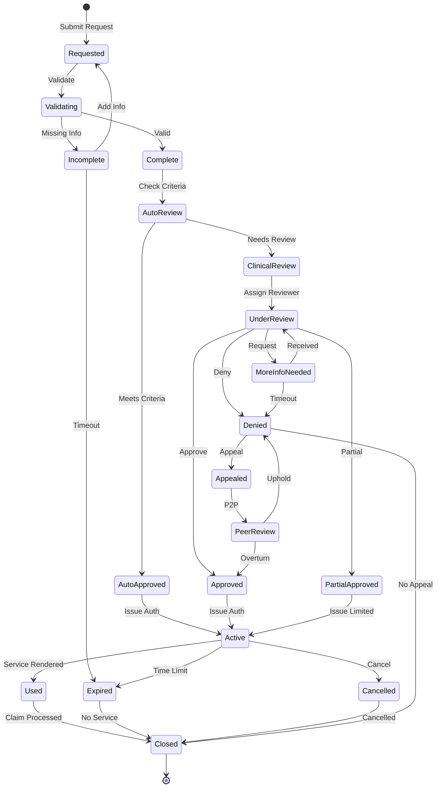

---

## 7. BATCH PROCESSING FLOWS

### 7.1 Nightly Batch Processing
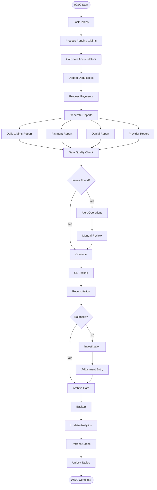

### 7.2 Monthly Closing Process
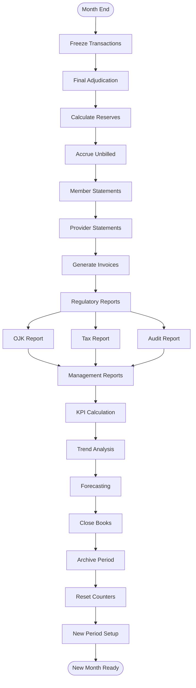

---

## 8. ERROR HANDLING FLOWS

### 8.1 System Error Recovery
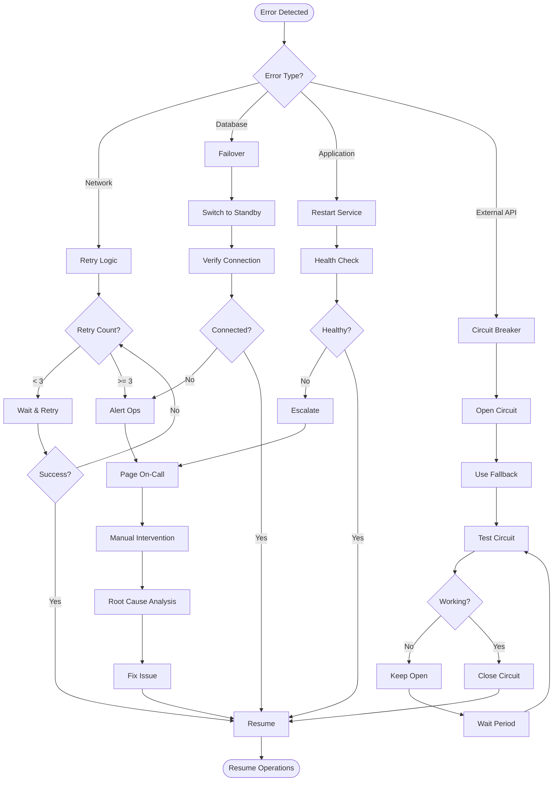

### 8.2 Data Inconsistency Resolution
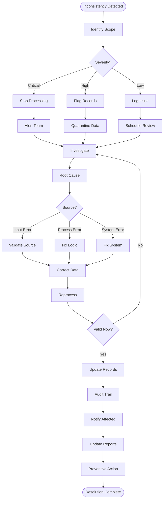

---

## 9. PERFORMANCE OPTIMIZATION FLOWS

### 9.1 Cache Strategy Flow
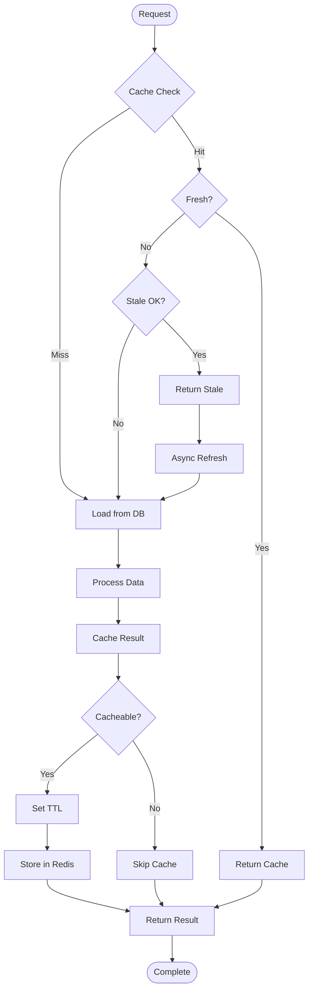

### 9.2 Load Balancing Strategy
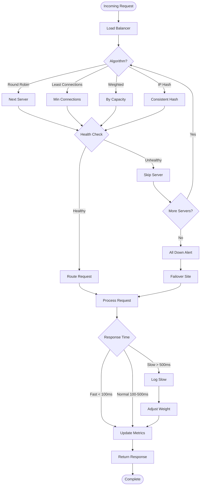

---

**Related Documents**:
- UI/UX Design Specifications
- Data Model Design
- API Specifications
- System Architecture
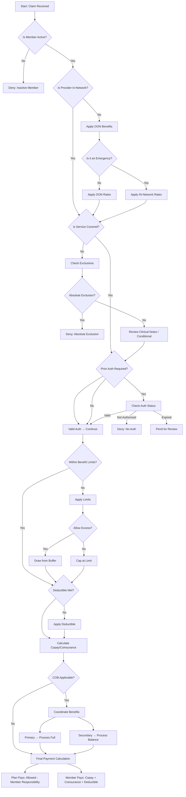
